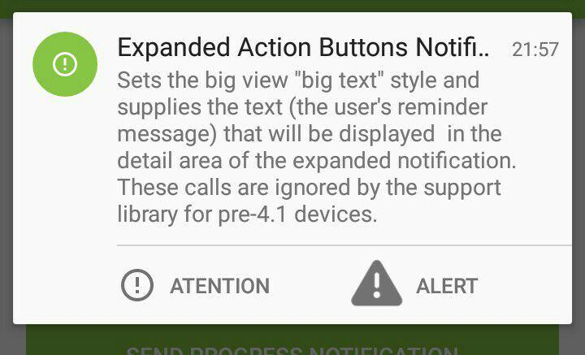
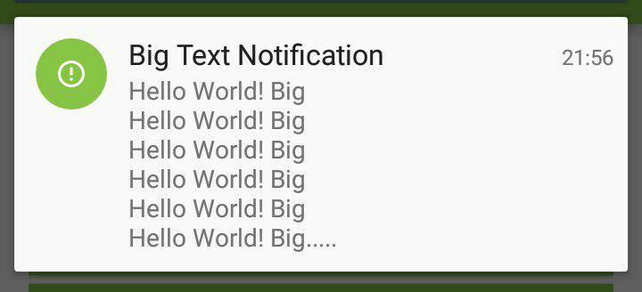
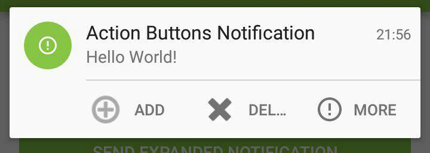
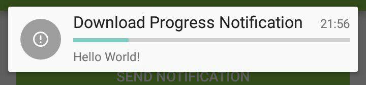
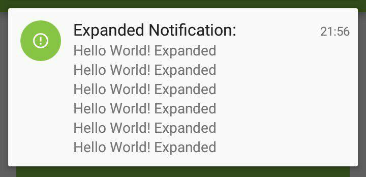

# Android Notifications Examples

This is an Android App witch shows multiple examples of notifications.
Yo can find more information about Notifications in the [Official Documentation].

## Examples you can find here

- Defaul Notifications
- Expandable Notifications
- Notifications with action Buttons
- Notifications redirecting to a Special Activity
- Progress Notifications
- Media Notifications
- Custom Layout Notifications
- Big Image Notifications
- High Priority Notifications

## Screenshots

[Official Documentation]:https://developer.android.com/guide/topics/ui/notifiers/notifications.html
